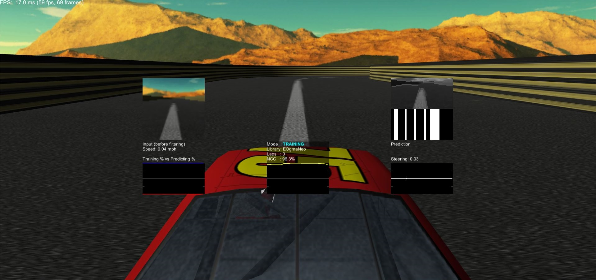
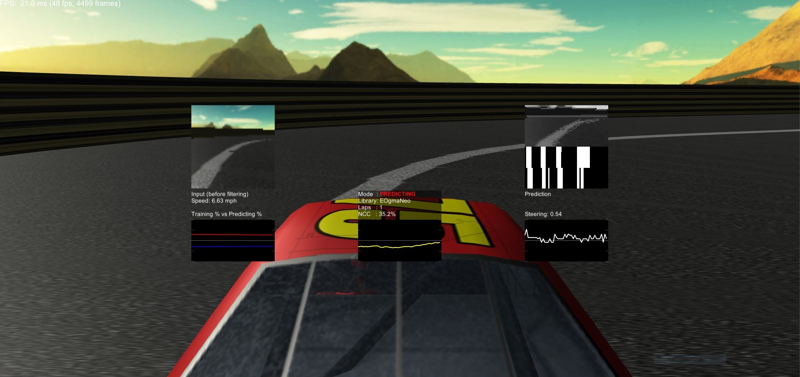
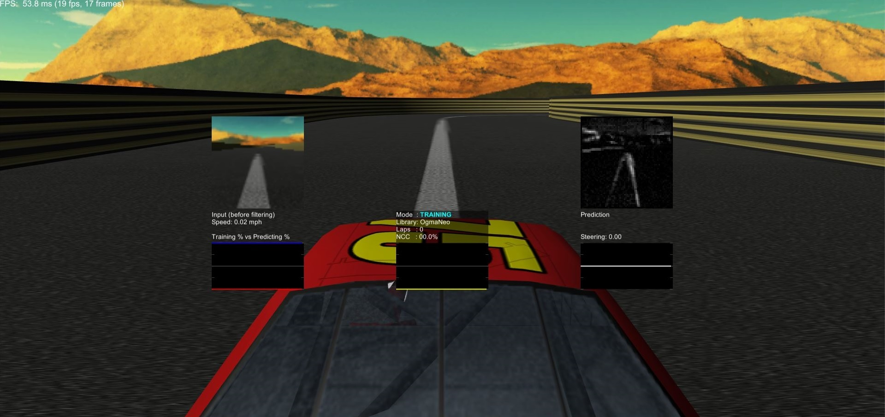
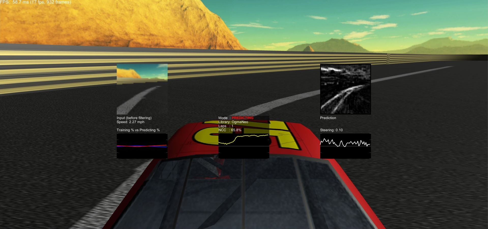

# OgmaDrive Standalone Application

This repository contains Mac OS X and Windows x64 standalone applications for [OgmaDrive](https://github.com/ogmacorp/OgmaDrive). OgmaDrive performs [online machine learning](https://en.wikipedia.org/wiki/Online_machine_learning) using a `predictive hierarchy` applied to `vehicle driving assistance` ([ADAS](https://en.wikipedia.org/wiki/Advanced_driver-assistance_systems)). The predictive hierarchy requires only a front-facing camera and steering angle as input. Which it then learns from, and predicts the next desired steering angle.

OgmaDrive uses the [Unity](https://unity3d.com/) engine, with custom C# scripts that create and use predictive hierarchies from two similar implementations. An initial menu allows the user to choose between the two predictive hierarchy implementations:

- [EOgmaNeo](https://github.com/ogmacorp/EOgmaNeo/) (CPU only), or
- [OgmaNeo](https://github.com/ogmacorp/OgmaNeo/) (GPU using OpenCL v1.2)

Each implementation provide a hands-free C# car controller script that follows a central spline around a procedurally generated track, the spline is used to initially assist in teaching the predictive hierarchy the relationship between desired steering angle and processed camera input. After the _first_ lap, hierarchy prediction confidence metrics are used to determine when to alternate between further training or taking control and autonomously drive the vehicle. Using only the front-facing camera as input to the hierarchy, that then predicts the steering angle based on it's acquired knowledge.

Refer to the [OgmaDrive](https://github.com/ogmacorp/OgmaDrive) repository for further details.

The [OgmaNeo](https://github.com/ogmacorp/OgmaNeo/) implementation assumes that your system has the appropriate graphics drivers with support for OpenCL v1.2

The [EOgmaNeo](https://github.com/ogmacorp/EOgmaNeo/) version has been optimized the most for this self-driving task, and is a SoC/Embedded system ready version. We currently use and test this implementation on a Raspberry Pi3 controlling an R/C car. Refer to the [EOgmaDrive](https://github.com/ogmacorp/EOgmaDrive/) repository for further details. To see the R/C car in action using EOgmaNeo refer to the following YouTube video:

## EOgmaNeo implementation screenshots

## OgmaNeo implementation screenshots

## License and Copyright

 The work in this repository is licensed under the <a rel="license" href="http://creativecommons.org/licenses/by-nc-sa/4.0/">Creative Commons Attribution-NonCommercial-ShareAlike 4.0 International License</a>.See the  [OGMADRIVEAPP_LICENSE.md](https://github.com/ogmacorp/OgmaDriveApp/blob/master/OGMADRIVEAPP_LICENSE.md) and [LICENSE.md](https://github.com/ogmacorp/OgmaDriveApp/blob/master/LICENSE.md) file for further information.

Contact Ogma via licenses@ogmacorp.com to discuss commercial use and licensing options.

OgmaDriveApp Copyright (c) 2017 [Ogma Intelligent Systems Corp](https://ogmacorp.com). All rights reserved.
